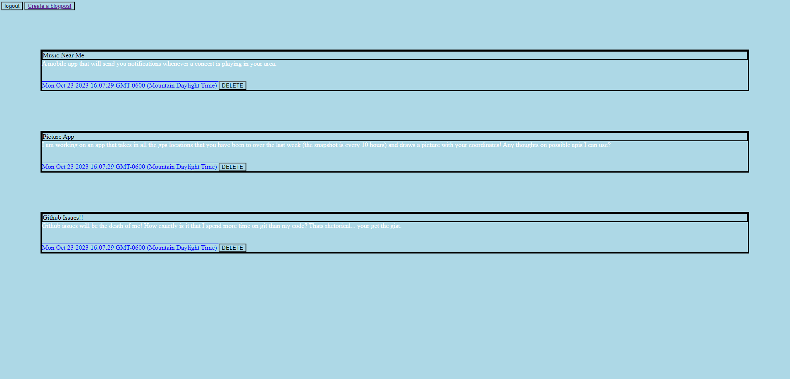

## Tech Blog

## Description
User will initially be greeted with a homepage that lists out a few current blogposts. At the top left hand cornder, user will see one login button. Upon clicking the button, user will be directed towards the login and signup page in which they can enter in information into either form and then be redirected to the homepage. Once back on the homepage, user will now see a logout button as well as a button to create a new blogpost. Once user click the button to create a blogpost, they will be redirected to another page where they will be able to write their name and blogpost content in the corresponding fields.

## Collaborators
AskBCS

## Screenshots

## Links
Github - https://github.com/Ali-Aldawoodi/Tech-blog
Heroku - https://tech-blog99-234f508c5521.herokuapp.com/
